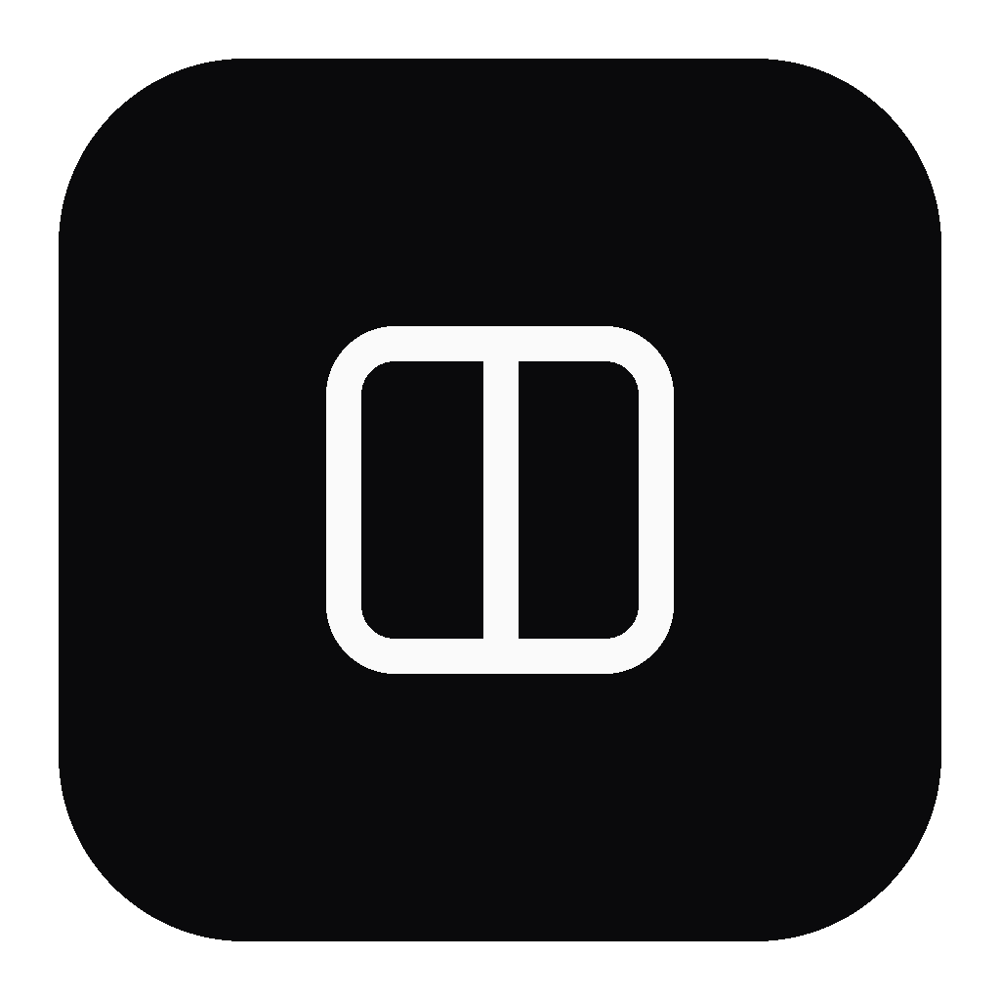

<div align="center">



<h3>Pane</h3>

<p><em>Every profile, its own internet.</em></p>

<p align="center">
  
  
  
  
</p>

<p align="center">
  <a href="https://github.com/andredezzy/pane/releases">Releases</a> ·
  <a href="https://github.com/andredezzy/pane/issues">Issues</a>
</p>

</div>

Pane is a multi-profile desktop browser built on Electron that gives each profile its own isolated session, proxy, and Chrome extension environment.

## Features

- **Session isolation** — cookies, storage, and cache are partitioned per profile; profiles never share data
- **Per-profile proxies** — each profile routes through its own HTTP, HTTPS, SOCKS4, or SOCKS5 proxy; authenticated SOCKS connections use a local relay
- **Browser fingerprinting** — configurable user agent, WebGL, canvas noise, audio noise, screen, timezone, and locale per profile
- **Chrome extensions** — install and auto-update extensions from the Chrome Web Store into every profile session
- **PIN lock with data wipe** — optional bcrypt-hashed PIN; five consecutive failures trigger a 3-pass overwrite of all profile data before relaunch
- **Google sign-in via CDP** — import Google and YouTube cookies from a local Chrome instance into any profile over the Chrome DevTools Protocol

## Getting started

### Requirements

- Bun >= 1.3.9
- Node >= 20

### Install

```bash
git clone https://github.com/andredezzy/pane.git
cd pane
bun install
```

### Run

```bash
bun dev
```

## Project structure

The workspace is managed with Turborepo and Bun workspaces.

```text
apps/
  veil/                          # @pane/veil — Electron main + React renderer; all UI and logic
packages/
  ui/                            # @pane/ui — shared shadcn-style UI primitives (source-level exports)
  electron-chrome-extensions/    # @pane/electron-chrome-extensions — Chrome extension API (Electron 41 fork)
  electron-chrome-context-menu/  # @pane/electron-chrome-context-menu — native-style right-click menus (fork)
  config-typescript/             # @pane/typescript-config — shared tsconfig base
  config-tsdown/                 # @pane/config-tsdown — shared tsdown build config
  config-test/                   # @pane/config-test — shared Vitest config
```

## Scripts

```bash
bun dev              # start everything in watch mode via Turborepo
bun run build        # build all packages
bun run test         # run Vitest across all packages
bun run typecheck    # type-check across all packages
bun run lint         # ESLint --fix + Biome check --write
bun run knip         # check for unused files, deps, and exports
```

To produce a distributable:

```bash
cd apps/veil && bun run dist     # DMG on macOS via electron-builder
```

Output lands in `apps/veil/release/`.

## Security

Report vulnerabilities to contact@andredezzy.com.

Not yet licensed — all rights reserved until a LICENSE file is added.
